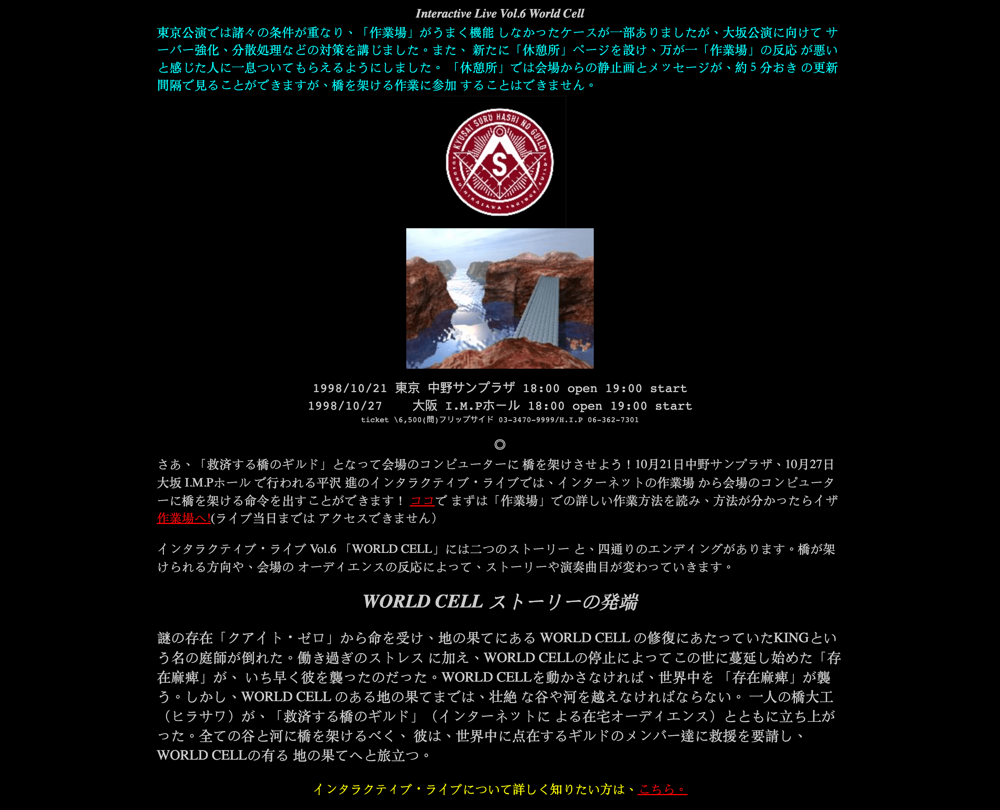
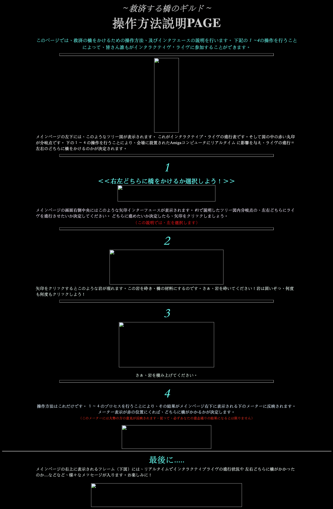

# Vol.6 World Cell (1998) 

## 簡介

### 官網

- [Interactive Live Vol.6 World Cell](https://web.archive.org/web/19981202233150/http://www2s.biglobe.ne.jp/~medit5/guild/)
  - 取自 Wayback Mchine

### 日期 
- 1998/10/21 東京 中野サンプラザ
- 1998/10/27 大阪 I.M.Pホール

### 人設
- 橋大工（ヒラサワ） 
  - ヒラサワ。KINGを救うために、橋を架けながらWORLD CELL修復の旅に出かける。
  - 彼は第二次世界大戦の捕虜兵の子孫でもあるらしい???
- 救済する橋のギルド（在宅オーディエンス）
  - インタネットを通じてヒラサワとともに「橋を架ける」作業を行う在宅オーディエンスの総称。
- KING 
  - 「人の世が全きものであるように」働く庭師。WORLD CELLの停止により、存在麻痺を患い倒れる。
- JEHM
  - ナーシサス次元から来た女神。クアイト・ゼロの使者でもある。
- MOTHER
  - 「死の種子」「生の種子」を降らせる。
- イレーサー
  - 「存在麻痺」をもたらすデジタル・ホルモン。
  - 橋大工ヒラサワがWORLD CELLに辿り着くのを阻止しようとする。
- クアイト・ゼロ
  - ？？？？？？？？

## 故事
謎の存在「クアイト・ゼロ」から命を受け、地の果てにある WORLD CELL の修復にあたっていたKINGという名の庭師が倒れた。働き過ぎのストレス に加え、WORLD CELLの停止によってこの世に蔓延し始めた「存在麻痺」が、 いち早く彼を襲ったのだった。WORLD CELLを動かさなければ、世界中を 「存在麻痺」が襲う。しかし、WORLD CELL のある地の果てまでは、壮絶 な谷や河を越えなければならない。 一人の橋大工（ヒラサワ）が、「救済する橋のギルド」（インターネットに よる在宅オーディエンス）とともに立ち上がった。全ての谷と河に橋を架けるべく、 彼は、世界中に点在するギルドのメンバー達に救援を要請し、WORLD CELLの有る 地の果てへと旅立つ。

## 演唱曲目（10/27大阪）
1. TOWN-0 PHASE-5
2. 救済の技法
3. Caravan
4. Kingdom
5. 庭師KING
6. ナーシサス次元から来た人
7. GHOST BRIDGE
8. MOON TIME
9. 万象の奇夜
10. MOTHER
11. 橋大工
12. WORLD CELL
13. TOWN-0 PHASE-5
(ENCORE)
14. WORLD CELL
15. 救済の技法

## 不負責任翻譯

### 人設
- 橋大工（ヒラサワ） 
  - 為了拯救KING，架設大橋修復WORLD CELL。
- 架橋團隊（網上觀眾）
  - 跟ヒラサワ一起架橋的網上觀眾。
- KING 
  - 為了全世界的人而工作的園師，因為過度工作加上WORLD CELL的停止，患上「存在麻痺」而倒下。
- JEHM
  - 來自水仙次元的女神。也是奉命於QUITE-0。
- MOTHER
  - 令「死之種子」「生之種子」降落。
- イレーサー（Eraser？）
  - 拿住「存在麻痺」的Digital Hormon？（這個不懂翻譯...）
  - 為了阻止橋大工架橋修復WORLD CELL
- QUITE-0
  - ？？？？？？？？

### 故事
簡單來說就是一直在工作的園師KING倒下，WORLD CELL的停止令到「存在麻痺」在世界上蔓延。因為去修復WORLD CELL的路途要穿山過河，所以我們跟住ヒラサワ一起架橘去修復WORLD CELL...

### GOOD & BAD ENDING
GOOD ENDING
- WORLD CELL本身就有著為了世界更好的自我毀滅程式，KING也適用於這段文字（KING跟WORLD CELL是連繫住的），所以把KING放置，將那些悲慘的紀錄一起消滅，世界就會有正確的運行方向，產生了「PHASE-6」，向「PHASE-6」前進。

BAD ENDING
- 我們跟住ヒラサワ一起到WORLD CELL前，看到WORLD CELL已經正在運行中。「不可思議吧？」QUITE-0說著...WORLD CELL會紀錄世界的經驗，並有著自我毀滅程式，這個自我毀滅程式是為了令下一代有更好的經驗，KING也適用於這個程式。但我們救了KING，世界殘留住不應該存在的紀錄，也產生不到「PHASE-6」...悲慘的經驗會在世界裡不停重覆。

~~結論係我地咩都唔做成場live等KING死咗去咪得（咦）~~

## 考察
看網上的報告這場是第一場有網上觀眾一起參與的機會，1998年，Windows98才剛剛出，當時的瀏覽器是用Netscape而不是用IE，用當年的技術角度來看真的很強。

另外這次的大阪場是有電視直播的，片段在某影片網站流傳了很久，所以我才可以寫下這篇不負責任考察（逃）

### 設備
根據網上的報告，當時大概有下面的特別設備：
1. AMIGA電腦
2. 觀眾席後方的攝影機 (拍下演出時的相片然後半實時上傳到網上)
3. [Sony Glasstron](https://en.wikipedia.org/wiki/Glasstron) (在橋大工時出現的類似VR東西，戴上後都是可以看到屏幕上的東西)
4. [Miburi](https://en.wikipedia.org/wiki/Miburi) (穿上後可以用身體的活動來當MIDI的東西)

### 故事線
兩場最後也是以BAD ENDING完結，但大阪場最後有播放到GOOD ENDING。而HOT POINT有3個。

**POINT 1.1 架設哪座橋？(網上觀眾選擇)**
  - L: Kingの夢
  - R: WORD CELLの伝承 (大阪場)

**POINT 1.2 用甚麼石材修復？ (現場觀眾選擇)**
  - L: (大阪場)
  - R:

**POINT 2 選擇哪種武器對付イレーサー？(現場觀眾選擇)**
  - L: ミブラトニシン (東京場)
  - R: ギタドレナリン (大阪場)

(這兩個選項本就是師匠耍帥的表漬！L是Miburi，R是結他SOLO)

**POINT 3.1 架設哪座橋？(網上觀眾選擇)**
  - L: MOTHERの丘
  - R: 月夜の丘 (大阪場)

**POINT 3.2 KING突然面色變得很差，應該怎樣處理？(現場觀眾選擇)**
  - L: 放置する（放置）
  - R: 声援ショック（大聲聲援）(大阪場)

根據網上報告說東京場過後，當時網上BBS流傳著大阪場應該選擇"月夜の丘"之後"放置KING"，這樣才會有GOOD ENDING。當時網絡還沒有這麼多人在用所以才會選"聲援KING"吧？

### Web技術線
其實自己最想寫這邊的東西XD(職業病爆發)，首先附上當時的說明。

取自 [～救済する橋のギルド～ 操作方法説明PAGE](https://web.archive.org/web/19990218074948/http://www.tohgoku.or.jp/~system1/info/manu.html)

大概在這場已經畫下了其後的interactive live有甚麼主要的東西吧。
- 作業場
  - 故事進度線
  - 作業進度線
  - 現場畫面
- 討論版

首場東京場好像是當機了。而大阪場的網上觀眾是成功完成任務的。這場跟兩年後的賢者のプロペラ的網上觀眾做的工作也大致相同，就是瘋狂按按鈕，大家合力按到一定的次數就成功了。

---

#### 預想的體驗程式：

(P.S: 其實我只是想試一下[現在用的模版](https://vitepress.dev/guide/using-vue#using-components)有是不是很自由可以寫一下其他東西XD)

<CustomComponent/>

---

根據[技術團隊的報告](http://www.sim-web.org/amiga/amiga19.html)，當時技術線是這樣：

> 太字がAMIGAのソフト名です
> - 在宅オーディエンスがホームページ上でマウスクリックで岩を砕く
> - その結果情報を**AWebII**（AMIGA用ブラウザ）が取得する
> - それを**ARexx**（AMIGAのAppleScriptみたいなもの）を使って**ScalaMM**（オーサリングソフト）に引き渡す
> - **ScalaMM**が結果情報により判定を下し、対応する映像や音を再生する

現在來看是很正常的步驟，但以當時來說技術上來說是很複雜吧？2000年前猜想是用Perl來寫Backend，架構大概是User->Web Server->CGI->Perl Program這樣？

（師匠曾經在Twitter說過有寫過Perl，而且Green Page BBS是以cgi結尾，所以我猜是用Perl寫的吧？）

現在應該沒有人用Perl cgi寫Web吧？最大的問題是會令到Server負荷很大，因為每次User進入網站後也會重新執行Program，執行後便會完全結束Porgram，這樣不斷重覆會令到Server愈來愈慢。現在php用的是fastcgi（就是常說的php-fpm），初始化的時候便會建立起一個環境，裡面包括了多個worker，不會自動結束整個程序。然後當有Request的時候就傳遞一個worker去執行。

所以現在來看會當機也不是很特別的事情XD？不過看報告當時已經有先前做Server的壓力測試，這個真的十分佩服XD。

## 參考

- Report
  - [【平沢進】INTERACTIVE LIVE SHOW「WORLD CELL」（1998.10.27.TUE 大阪IMPホール）｜三万亭馬骨｜note](https://note.com/allsystemsgo/n/na75519746161)
  - [ひ組【解】WORLD CELLGOOD ENDING と BAD ENDING](https://higumi.com/higumi.rb?mode=pc&d1=anl&d2=il1998&a=01&n=01)

- 技術團隊 (NIFTY-SERVE FAMIGA) 報告
  - [第18話「天と地と女友達Live（1）」](http://www.sim-web.org/amiga/amiga18.html)
  - [第19話「天と地と女友達Live（2）」](http://www.sim-web.org/amiga/amiga19.html)